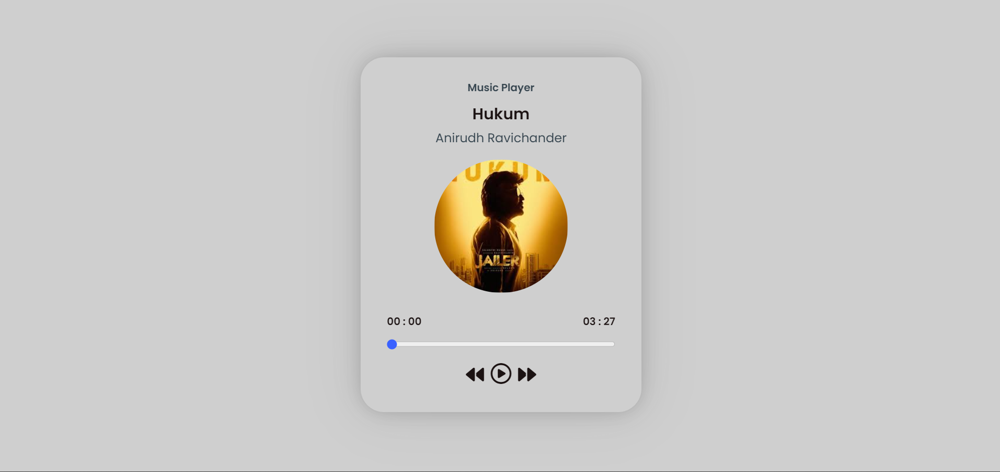
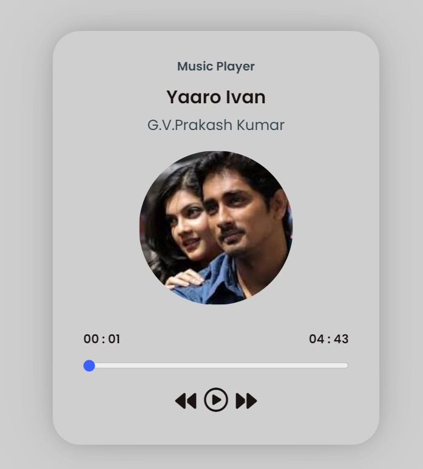

# React Music Player

Elevate your audio experience with React Music Player. Play, pause, and skip tracks effortlessly in this intuitive web app. React MusicPlayer is a simple web application built with React.js for playing audio files.

## Features

- Play audio files (MP3 format supported)
- Pause and resume playback
- Skip to the next track
- Display current playing track information

## Screenshots

## Live Demo

Check out the [live demo](https://main--musicplayerreactnew.netlify.app/) of our project!

## Technologies Used

- React.js
- HTML5 Audio API
- CSS (or any styling libraries used)

## Getting Started

To get a local copy up and running, follow these steps:

### Prerequisites

- Node.js
- npm

### Installation

1. Clone the repository:

   git clone https://github.com/SaiKribaMuralidharan/MusicPlayer.git

2. Navigate into the project directory:

   cd MusicPlayer

3. Install dependencies:

   npm install

### Usage

1. Start the development server:

npm start
2. Open your browser and go to `http://localhost:3000` to view the app.

### How to Use

- Click on a song to start playing.
- Use the player controls to pause, resume, or skip to the next track.

### Contributing

Contributions are welcome! If you'd like to add features or fix bugs:

1. Fork the repository
2. Create your feature branch (`git checkout -b feature/YourFeature`)
3. Commit your changes (`git commit -am 'Add some feature'`)
4. Push to the branch (`git push origin feature/YourFeature`)
5. Open a pull request

Please make sure to update tests as appropriate.

### License

This project is licensed under the MIT License - see the [LICENSE](LICENSE) file for details.

